# Benchmark mlsys-2026-10.json

- **Tensors:** 43
- **Ops:** 28 (MatMul: 14, Pointwise: 14)
- **Fast memory capacity:** 200000
- **Slow memory bandwidth:** 20.0
- **Native granularity:** [128, 128]

## Graph I/O

- **Graph inputs** (15): T0 (1024×1024=1048576), T1 (1024×1024=1048576), T4 (1024×1024=1048576), T6 (1024×1024=1048576), T9 (1024×1024=1048576), T11 (1024×1024=1048576), T14 (1024×1024=1048576), T16 (1024×1024=1048576), T19 (1024×1024=1048576), T21 (1024×1024=1048576), T24 (1024×1024=1048576), T26 (1024×1024=1048576), T29 (1024×1024=1048576), T36 (1024×1024=1048576), T39 (1024×1024=1048576)
- **Graph outputs** (1): T42 (1024×1024=1048576)

## Physical bounds

- **H.1 memory lower bound** (load inputs + store outputs): **838860.80**
- **H.1 compute lower bound** (Σ base_cost — undisputable): **59500.00**
- **H.1 absolute floor** (max of memory and simple compute): **838860.80**
- **H.3 tight compute floor** (Σ native_tiles × base_cost — model-dependent): **3808000.00**
- **H.2 brute-force memory upper bound** (every op in its own subgraph): **3932160.00**

Any reported total latency `< H.1 absolute floor` is physically impossible — no interpretation can save it.
Any reported total latency `< H.3 tight compute floor` violates our native-tile reading of base_cost.
Any reported total latency `> H.2` is a quality warning (worse than no-fusion brute-force).

## DAG

```mermaid
flowchart LR
    T0["T0<br/>1024×1024<br/>graph input"]:::gi
    T1["T1<br/>1024×1024<br/>graph input"]:::gi
    T2["T2<br/>1024×1024<br/>intermediate"]
    T3["T3<br/>1024×1024<br/>intermediate"]
    T4["T4<br/>1024×1024<br/>graph input"]:::gi
    T5["T5<br/>1024×1024<br/>intermediate"]
    T6["T6<br/>1024×1024<br/>graph input"]:::gi
    T7["T7<br/>1024×1024<br/>intermediate"]
    T8["T8<br/>1024×1024<br/>intermediate"]
    T9["T9<br/>1024×1024<br/>graph input"]:::gi
    T10["T10<br/>1024×1024<br/>intermediate"]
    T11["T11<br/>1024×1024<br/>graph input"]:::gi
    T12["T12<br/>1024×1024<br/>intermediate"]
    T13["T13<br/>1024×1024<br/>intermediate"]
    T14["T14<br/>1024×1024<br/>graph input"]:::gi
    T15["T15<br/>1024×1024<br/>intermediate"]
    T16["T16<br/>1024×1024<br/>graph input"]:::gi
    T17["T17<br/>1024×1024<br/>intermediate"]
    T18["T18<br/>1024×1024<br/>intermediate"]
    T19["T19<br/>1024×1024<br/>graph input"]:::gi
    T20["T20<br/>1024×1024<br/>intermediate"]
    T21["T21<br/>1024×1024<br/>graph input"]:::gi
    T22["T22<br/>1024×1024<br/>intermediate"]
    T23["T23<br/>1024×1024<br/>intermediate"]
    T24["T24<br/>1024×1024<br/>graph input"]:::gi
    T25["T25<br/>1024×1024<br/>intermediate"]
    T26["T26<br/>1024×1024<br/>graph input"]:::gi
    T27["T27<br/>1024×1024<br/>intermediate"]
    T28["T28<br/>1024×1024<br/>intermediate"]
    T29["T29<br/>1024×1024<br/>graph input"]:::gi
    T30["T30<br/>1024×1024<br/>intermediate"]
    T31["T31<br/>1024×1024<br/>intermediate"]
    T32["T32<br/>1024×1024<br/>intermediate"]
    T33["T33<br/>1024×1024<br/>intermediate"]
    T34["T34<br/>1024×1024<br/>intermediate"]
    T35["T35<br/>1024×1024<br/>intermediate"]
    T36["T36<br/>1024×1024<br/>graph input"]:::gi
    T37["T37<br/>1024×1024<br/>intermediate"]
    T38["T38<br/>1024×1024<br/>intermediate"]
    T39["T39<br/>1024×1024<br/>graph input"]:::gi
    T40["T40<br/>1024×1024<br/>intermediate"]
    T41["T41<br/>1024×1024<br/>intermediate"]
    T42["T42<br/>1024×1024<br/>graph output"]:::go
    Op0{"Op0<br/>MatMul<br/>cost=4000"}
    T0 --> Op0
    T1 --> Op0
    Op0 --> T2
    Op1{"Op1<br/>Pointwise<br/>cost=300"}
    T2 --> Op1
    Op1 --> T3
    Op2{"Op2<br/>MatMul<br/>cost=4000"}
    T3 --> Op2
    T4 --> Op2
    Op2 --> T5
    Op3{"Op3<br/>MatMul<br/>cost=4000"}
    T0 --> Op3
    T6 --> Op3
    Op3 --> T7
    Op4{"Op4<br/>Pointwise<br/>cost=300"}
    T7 --> Op4
    Op4 --> T8
    Op5{"Op5<br/>MatMul<br/>cost=4000"}
    T8 --> Op5
    T9 --> Op5
    Op5 --> T10
    Op6{"Op6<br/>MatMul<br/>cost=4000"}
    T0 --> Op6
    T11 --> Op6
    Op6 --> T12
    Op7{"Op7<br/>Pointwise<br/>cost=300"}
    T12 --> Op7
    Op7 --> T13
    Op8{"Op8<br/>MatMul<br/>cost=4000"}
    T13 --> Op8
    T14 --> Op8
    Op8 --> T15
    Op9{"Op9<br/>MatMul<br/>cost=4000"}
    T0 --> Op9
    T16 --> Op9
    Op9 --> T17
    Op10{"Op10<br/>Pointwise<br/>cost=300"}
    T17 --> Op10
    Op10 --> T18
    Op11{"Op11<br/>MatMul<br/>cost=4000"}
    T18 --> Op11
    T19 --> Op11
    Op11 --> T20
    Op12{"Op12<br/>MatMul<br/>cost=4000"}
    T0 --> Op12
    T21 --> Op12
    Op12 --> T22
    Op13{"Op13<br/>Pointwise<br/>cost=300"}
    T22 --> Op13
    Op13 --> T23
    Op14{"Op14<br/>MatMul<br/>cost=4000"}
    T23 --> Op14
    T24 --> Op14
    Op14 --> T25
    Op15{"Op15<br/>MatMul<br/>cost=4000"}
    T0 --> Op15
    T26 --> Op15
    Op15 --> T27
    Op16{"Op16<br/>Pointwise<br/>cost=300"}
    T27 --> Op16
    Op16 --> T28
    Op17{"Op17<br/>MatMul<br/>cost=4000"}
    T28 --> Op17
    T29 --> Op17
    Op17 --> T30
    Op18{"Op18<br/>Pointwise<br/>cost=200"}
    T5 --> Op18
    T10 --> Op18
    Op18 --> T31
    Op19{"Op19<br/>Pointwise<br/>cost=200"}
    T15 --> Op19
    T20 --> Op19
    Op19 --> T32
    Op20{"Op20<br/>Pointwise<br/>cost=200"}
    T25 --> Op20
    T30 --> Op20
    Op20 --> T33
    Op21{"Op21<br/>Pointwise<br/>cost=200"}
    T31 --> Op21
    T32 --> Op21
    Op21 --> T34
    Op22{"Op22<br/>Pointwise<br/>cost=200"}
    T34 --> Op22
    T33 --> Op22
    Op22 --> T35
    Op23{"Op23<br/>MatMul<br/>cost=4000"}
    T35 --> Op23
    T36 --> Op23
    Op23 --> T37
    Op24{"Op24<br/>Pointwise<br/>cost=200"}
    T37 --> Op24
    Op24 --> T38
    Op25{"Op25<br/>MatMul<br/>cost=4000"}
    T38 --> Op25
    T39 --> Op25
    Op25 --> T40
    Op26{"Op26<br/>Pointwise<br/>cost=200"}
    T40 --> Op26
    Op26 --> T41
    Op27{"Op27<br/>Pointwise<br/>cost=300"}
    T41 --> Op27
    Op27 --> T42

    classDef gi fill:#cde4ff,stroke:#2a5fb0,stroke-width:2px
    classDef go fill:#ffd4a8,stroke:#b06a2a,stroke-width:2px
    classDef dangling fill:#eeeeee,stroke:#999,stroke-dasharray: 3 3
```

