# Benchmark mlsys-2026-12.json

- **Tensors:** 42
- **Ops:** 31 (MatMul: 10, Pointwise: 21)
- **Fast memory capacity:** 180000
- **Slow memory bandwidth:** 25.0
- **Native granularity:** [128, 128]

## Graph I/O

- **Graph inputs** (11): T0 (512×1024=524288), T1 (1024×1024=1048576), T4 (1024×1024=1048576), T8 (1024×1024=1048576), T11 (1024×1024=1048576), T15 (1024×1024=1048576), T18 (1024×1024=1048576), T22 (1024×1024=1048576), T25 (1024×1024=1048576), T29 (1024×1024=1048576), T32 (1024×1024=1048576)
- **Graph outputs** (1): T41 (512×1024=524288)

## Physical bounds

- **H.1 memory lower bound** (load inputs + store outputs): **461373.44**
- **H.1 compute lower bound** (Σ base_cost — undisputable): **54800.00**
- **H.1 absolute floor** (max of memory and simple compute): **461373.44**
- **H.3 tight compute floor** (Σ native_tiles × base_cost — model-dependent): **1753600.00**
- **H.2 brute-force memory upper bound** (every op in its own subgraph): **1824522.24**

Any reported total latency `< H.1 absolute floor` is physically impossible — no interpretation can save it.
Any reported total latency `< H.3 tight compute floor` violates our native-tile reading of base_cost.
Any reported total latency `> H.2` is a quality warning (worse than no-fusion brute-force).

## DAG

```mermaid
flowchart LR
    T0["T0<br/>512×1024<br/>graph input"]:::gi
    T1["T1<br/>1024×1024<br/>graph input"]:::gi
    T2["T2<br/>512×1024<br/>intermediate"]
    T3["T3<br/>512×1024<br/>intermediate"]
    T4["T4<br/>1024×1024<br/>graph input"]:::gi
    T5["T5<br/>512×1024<br/>intermediate"]
    T6["T6<br/>512×1024<br/>intermediate"]
    T7["T7<br/>512×1024<br/>intermediate"]
    T8["T8<br/>1024×1024<br/>graph input"]:::gi
    T9["T9<br/>512×1024<br/>intermediate"]
    T10["T10<br/>512×1024<br/>intermediate"]
    T11["T11<br/>1024×1024<br/>graph input"]:::gi
    T12["T12<br/>512×1024<br/>intermediate"]
    T13["T13<br/>512×1024<br/>intermediate"]
    T14["T14<br/>512×1024<br/>intermediate"]
    T15["T15<br/>1024×1024<br/>graph input"]:::gi
    T16["T16<br/>512×1024<br/>intermediate"]
    T17["T17<br/>512×1024<br/>intermediate"]
    T18["T18<br/>1024×1024<br/>graph input"]:::gi
    T19["T19<br/>512×1024<br/>intermediate"]
    T20["T20<br/>512×1024<br/>intermediate"]
    T21["T21<br/>512×1024<br/>intermediate"]
    T22["T22<br/>1024×1024<br/>graph input"]:::gi
    T23["T23<br/>512×1024<br/>intermediate"]
    T24["T24<br/>512×1024<br/>intermediate"]
    T25["T25<br/>1024×1024<br/>graph input"]:::gi
    T26["T26<br/>512×1024<br/>intermediate"]
    T27["T27<br/>512×1024<br/>intermediate"]
    T28["T28<br/>512×1024<br/>intermediate"]
    T29["T29<br/>1024×1024<br/>graph input"]:::gi
    T30["T30<br/>512×1024<br/>intermediate"]
    T31["T31<br/>512×1024<br/>intermediate"]
    T32["T32<br/>1024×1024<br/>graph input"]:::gi
    T33["T33<br/>512×1024<br/>intermediate"]
    T34["T34<br/>512×1024<br/>intermediate"]
    T35["T35<br/>512×1024<br/>intermediate"]
    T36["T36<br/>512×1024<br/>intermediate"]
    T37["T37<br/>512×1024<br/>intermediate"]
    T38["T38<br/>512×1024<br/>intermediate"]
    T39["T39<br/>512×1024<br/>intermediate"]
    T40["T40<br/>512×1024<br/>intermediate"]
    T41["T41<br/>512×1024<br/>graph output"]:::go
    Op0{"Op0<br/>MatMul<br/>cost=5000"}
    T0 --> Op0
    T1 --> Op0
    Op0 --> T2
    Op1{"Op1<br/>Pointwise<br/>cost=200"}
    T2 --> Op1
    Op1 --> T3
    Op2{"Op2<br/>MatMul<br/>cost=5000"}
    T3 --> Op2
    T4 --> Op2
    Op2 --> T5
    Op3{"Op3<br/>Pointwise<br/>cost=200"}
    T5 --> Op3
    Op3 --> T6
    Op4{"Op4<br/>Pointwise<br/>cost=200"}
    T6 --> Op4
    T3 --> Op4
    Op4 --> T7
    Op5{"Op5<br/>MatMul<br/>cost=5000"}
    T7 --> Op5
    T8 --> Op5
    Op5 --> T9
    Op6{"Op6<br/>Pointwise<br/>cost=200"}
    T9 --> Op6
    Op6 --> T10
    Op7{"Op7<br/>MatMul<br/>cost=5000"}
    T10 --> Op7
    T11 --> Op7
    Op7 --> T12
    Op8{"Op8<br/>Pointwise<br/>cost=200"}
    T12 --> Op8
    Op8 --> T13
    Op9{"Op9<br/>Pointwise<br/>cost=200"}
    T13 --> Op9
    T10 --> Op9
    Op9 --> T14
    Op10{"Op10<br/>MatMul<br/>cost=5000"}
    T14 --> Op10
    T15 --> Op10
    Op10 --> T16
    Op11{"Op11<br/>Pointwise<br/>cost=200"}
    T16 --> Op11
    Op11 --> T17
    Op12{"Op12<br/>MatMul<br/>cost=5000"}
    T17 --> Op12
    T18 --> Op12
    Op12 --> T19
    Op13{"Op13<br/>Pointwise<br/>cost=200"}
    T19 --> Op13
    Op13 --> T20
    Op14{"Op14<br/>Pointwise<br/>cost=200"}
    T20 --> Op14
    T17 --> Op14
    Op14 --> T21
    Op15{"Op15<br/>MatMul<br/>cost=5000"}
    T21 --> Op15
    T22 --> Op15
    Op15 --> T23
    Op16{"Op16<br/>Pointwise<br/>cost=200"}
    T23 --> Op16
    Op16 --> T24
    Op17{"Op17<br/>MatMul<br/>cost=5000"}
    T24 --> Op17
    T25 --> Op17
    Op17 --> T26
    Op18{"Op18<br/>Pointwise<br/>cost=200"}
    T26 --> Op18
    Op18 --> T27
    Op19{"Op19<br/>Pointwise<br/>cost=200"}
    T27 --> Op19
    T24 --> Op19
    Op19 --> T28
    Op20{"Op20<br/>MatMul<br/>cost=5000"}
    T28 --> Op20
    T29 --> Op20
    Op20 --> T30
    Op21{"Op21<br/>Pointwise<br/>cost=200"}
    T30 --> Op21
    Op21 --> T31
    Op22{"Op22<br/>MatMul<br/>cost=5000"}
    T31 --> Op22
    T32 --> Op22
    Op22 --> T33
    Op23{"Op23<br/>Pointwise<br/>cost=200"}
    T33 --> Op23
    Op23 --> T34
    Op24{"Op24<br/>Pointwise<br/>cost=200"}
    T34 --> Op24
    T31 --> Op24
    Op24 --> T35
    Op25{"Op25<br/>Pointwise<br/>cost=300"}
    T35 --> Op25
    Op25 --> T36
    Op26{"Op26<br/>Pointwise<br/>cost=300"}
    T36 --> Op26
    Op26 --> T37
    Op27{"Op27<br/>Pointwise<br/>cost=300"}
    T37 --> Op27
    Op27 --> T38
    Op28{"Op28<br/>Pointwise<br/>cost=300"}
    T38 --> Op28
    Op28 --> T39
    Op29{"Op29<br/>Pointwise<br/>cost=300"}
    T39 --> Op29
    Op29 --> T40
    Op30{"Op30<br/>Pointwise<br/>cost=300"}
    T40 --> Op30
    Op30 --> T41

    classDef gi fill:#cde4ff,stroke:#2a5fb0,stroke-width:2px
    classDef go fill:#ffd4a8,stroke:#b06a2a,stroke-width:2px
    classDef dangling fill:#eeeeee,stroke:#999,stroke-dasharray: 3 3
```

