# Benchmark mlsys-2026-16.json

- **Tensors:** 85
- **Ops:** 63 (MatMul: 21, Pointwise: 42)
- **Fast memory capacity:** 300000
- **Slow memory bandwidth:** 30.0
- **Native granularity:** [128, 128]

## Graph I/O

- **Graph inputs** (22): T0 (512×1024=524288), T1 (1024×1024=1048576), T5 (1024×1024=1048576), T9 (1024×1024=1048576), T13 (1024×1024=1048576), T17 (1024×1024=1048576), T21 (1024×1024=1048576), T25 (1024×1024=1048576), T29 (1024×1024=1048576), T33 (1024×1024=1048576), T37 (1024×1024=1048576), T41 (1024×1024=1048576), T46 (1024×1024=1048576), T51 (1024×1024=1048576), T56 (1024×1024=1048576), T61 (1024×1024=1048576), T67 (1024×1024=1048576), T70 (1024×1024=1048576), T73 (1024×1024=1048576), T76 (1024×1024=1048576), T79 (1024×1024=1048576), T82 (1024×1024=1048576)
- **Graph outputs** (1): T84 (512×1024=524288)

## Physical bounds

- **H.1 memory lower bound** (load inputs + store outputs): **768955.73**
- **H.1 compute lower bound** (Σ base_cost — undisputable): **129200.00**
- **H.1 absolute floor** (max of memory and simple compute): **768955.73**
- **H.3 tight compute floor** (Σ native_tiles × base_cost — model-dependent): **4134400.00**
- **H.2 brute-force memory upper bound** (every op in its own subgraph): **2953489.07**

Any reported total latency `< H.1 absolute floor` is physically impossible — no interpretation can save it.
Any reported total latency `< H.3 tight compute floor` violates our native-tile reading of base_cost.
Any reported total latency `> H.2` is a quality warning (worse than no-fusion brute-force).

## DAG

```mermaid
flowchart LR
    T0["T0<br/>512×1024<br/>graph input"]:::gi
    T1["T1<br/>1024×1024<br/>graph input"]:::gi
    T2["T2<br/>512×1024<br/>intermediate"]
    T3["T3<br/>512×1024<br/>intermediate"]
    T4["T4<br/>512×1024<br/>intermediate"]
    T5["T5<br/>1024×1024<br/>graph input"]:::gi
    T6["T6<br/>512×1024<br/>intermediate"]
    T7["T7<br/>512×1024<br/>intermediate"]
    T8["T8<br/>512×1024<br/>intermediate"]
    T9["T9<br/>1024×1024<br/>graph input"]:::gi
    T10["T10<br/>512×1024<br/>intermediate"]
    T11["T11<br/>512×1024<br/>intermediate"]
    T12["T12<br/>512×1024<br/>intermediate"]
    T13["T13<br/>1024×1024<br/>graph input"]:::gi
    T14["T14<br/>512×1024<br/>intermediate"]
    T15["T15<br/>512×1024<br/>intermediate"]
    T16["T16<br/>512×1024<br/>intermediate"]
    T17["T17<br/>1024×1024<br/>graph input"]:::gi
    T18["T18<br/>512×1024<br/>intermediate"]
    T19["T19<br/>512×1024<br/>intermediate"]
    T20["T20<br/>512×1024<br/>intermediate"]
    T21["T21<br/>1024×1024<br/>graph input"]:::gi
    T22["T22<br/>512×1024<br/>intermediate"]
    T23["T23<br/>512×1024<br/>intermediate"]
    T24["T24<br/>512×1024<br/>intermediate"]
    T25["T25<br/>1024×1024<br/>graph input"]:::gi
    T26["T26<br/>512×1024<br/>intermediate"]
    T27["T27<br/>512×1024<br/>intermediate"]
    T28["T28<br/>512×1024<br/>intermediate"]
    T29["T29<br/>1024×1024<br/>graph input"]:::gi
    T30["T30<br/>512×1024<br/>intermediate"]
    T31["T31<br/>512×1024<br/>intermediate"]
    T32["T32<br/>512×1024<br/>intermediate"]
    T33["T33<br/>1024×1024<br/>graph input"]:::gi
    T34["T34<br/>512×1024<br/>intermediate"]
    T35["T35<br/>512×1024<br/>intermediate"]
    T36["T36<br/>512×1024<br/>intermediate"]
    T37["T37<br/>1024×1024<br/>graph input"]:::gi
    T38["T38<br/>512×1024<br/>intermediate"]
    T39["T39<br/>512×1024<br/>intermediate"]
    T40["T40<br/>512×1024<br/>intermediate"]
    T41["T41<br/>1024×1024<br/>graph input"]:::gi
    T42["T42<br/>512×1024<br/>intermediate"]
    T43["T43<br/>512×1024<br/>intermediate"]
    T44["T44<br/>512×1024<br/>intermediate"]
    T45["T45<br/>512×1024<br/>intermediate"]
    T46["T46<br/>1024×1024<br/>graph input"]:::gi
    T47["T47<br/>512×1024<br/>intermediate"]
    T48["T48<br/>512×1024<br/>intermediate"]
    T49["T49<br/>512×1024<br/>intermediate"]
    T50["T50<br/>512×1024<br/>intermediate"]
    T51["T51<br/>1024×1024<br/>graph input"]:::gi
    T52["T52<br/>512×1024<br/>intermediate"]
    T53["T53<br/>512×1024<br/>intermediate"]
    T54["T54<br/>512×1024<br/>intermediate"]
    T55["T55<br/>512×1024<br/>intermediate"]
    T56["T56<br/>1024×1024<br/>graph input"]:::gi
    T57["T57<br/>512×1024<br/>intermediate"]
    T58["T58<br/>512×1024<br/>intermediate"]
    T59["T59<br/>512×1024<br/>intermediate"]
    T60["T60<br/>512×1024<br/>intermediate"]
    T61["T61<br/>1024×1024<br/>graph input"]:::gi
    T62["T62<br/>512×1024<br/>intermediate"]
    T63["T63<br/>512×1024<br/>intermediate"]
    T64["T64<br/>512×1024<br/>intermediate"]
    T65["T65<br/>512×1024<br/>intermediate"]
    T66["T66<br/>512×1024<br/>intermediate"]
    T67["T67<br/>1024×1024<br/>graph input"]:::gi
    T68["T68<br/>512×1024<br/>intermediate"]
    T69["T69<br/>512×1024<br/>intermediate"]
    T70["T70<br/>1024×1024<br/>graph input"]:::gi
    T71["T71<br/>512×1024<br/>intermediate"]
    T72["T72<br/>512×1024<br/>intermediate"]
    T73["T73<br/>1024×1024<br/>graph input"]:::gi
    T74["T74<br/>512×1024<br/>intermediate"]
    T75["T75<br/>512×1024<br/>intermediate"]
    T76["T76<br/>1024×1024<br/>graph input"]:::gi
    T77["T77<br/>512×1024<br/>intermediate"]
    T78["T78<br/>512×1024<br/>intermediate"]
    T79["T79<br/>1024×1024<br/>graph input"]:::gi
    T80["T80<br/>512×1024<br/>intermediate"]
    T81["T81<br/>512×1024<br/>intermediate"]
    T82["T82<br/>1024×1024<br/>graph input"]:::gi
    T83["T83<br/>512×1024<br/>intermediate"]
    T84["T84<br/>512×1024<br/>graph output"]:::go
    Op0{"Op0<br/>MatMul<br/>cost=1000"}
    T0 --> Op0
    T1 --> Op0
    Op0 --> T2
    Op1{"Op1<br/>Pointwise<br/>cost=2000"}
    T2 --> Op1
    Op1 --> T3
    Op2{"Op2<br/>Pointwise<br/>cost=3000"}
    T3 --> Op2
    Op2 --> T4
    Op3{"Op3<br/>MatMul<br/>cost=4000"}
    T4 --> Op3
    T5 --> Op3
    Op3 --> T6
    Op4{"Op4<br/>Pointwise<br/>cost=5000"}
    T6 --> Op4
    Op4 --> T7
    Op5{"Op5<br/>Pointwise<br/>cost=1000"}
    T7 --> Op5
    Op5 --> T8
    Op6{"Op6<br/>MatMul<br/>cost=2000"}
    T8 --> Op6
    T9 --> Op6
    Op6 --> T10
    Op7{"Op7<br/>Pointwise<br/>cost=3000"}
    T10 --> Op7
    Op7 --> T11
    Op8{"Op8<br/>Pointwise<br/>cost=4000"}
    T11 --> Op8
    Op8 --> T12
    Op9{"Op9<br/>MatMul<br/>cost=5000"}
    T12 --> Op9
    T13 --> Op9
    Op9 --> T14
    Op10{"Op10<br/>Pointwise<br/>cost=1000"}
    T14 --> Op10
    Op10 --> T15
    Op11{"Op11<br/>Pointwise<br/>cost=2000"}
    T15 --> Op11
    Op11 --> T16
    Op12{"Op12<br/>MatMul<br/>cost=3000"}
    T16 --> Op12
    T17 --> Op12
    Op12 --> T18
    Op13{"Op13<br/>Pointwise<br/>cost=4000"}
    T18 --> Op13
    Op13 --> T19
    Op14{"Op14<br/>Pointwise<br/>cost=5000"}
    T19 --> Op14
    Op14 --> T20
    Op15{"Op15<br/>MatMul<br/>cost=1000"}
    T20 --> Op15
    T21 --> Op15
    Op15 --> T22
    Op16{"Op16<br/>Pointwise<br/>cost=2000"}
    T22 --> Op16
    Op16 --> T23
    Op17{"Op17<br/>Pointwise<br/>cost=3000"}
    T23 --> Op17
    Op17 --> T24
    Op18{"Op18<br/>MatMul<br/>cost=4000"}
    T24 --> Op18
    T25 --> Op18
    Op18 --> T26
    Op19{"Op19<br/>Pointwise<br/>cost=5000"}
    T26 --> Op19
    Op19 --> T27
    Op20{"Op20<br/>Pointwise<br/>cost=1000"}
    T27 --> Op20
    Op20 --> T28
    Op21{"Op21<br/>MatMul<br/>cost=2000"}
    T28 --> Op21
    T29 --> Op21
    Op21 --> T30
    Op22{"Op22<br/>Pointwise<br/>cost=3000"}
    T30 --> Op22
    Op22 --> T31
    Op23{"Op23<br/>Pointwise<br/>cost=4000"}
    T31 --> Op23
    Op23 --> T32
    Op24{"Op24<br/>MatMul<br/>cost=5000"}
    T32 --> Op24
    T33 --> Op24
    Op24 --> T34
    Op25{"Op25<br/>Pointwise<br/>cost=1000"}
    T34 --> Op25
    Op25 --> T35
    Op26{"Op26<br/>Pointwise<br/>cost=2000"}
    T35 --> Op26
    Op26 --> T36
    Op27{"Op27<br/>MatMul<br/>cost=3000"}
    T36 --> Op27
    T37 --> Op27
    Op27 --> T38
    Op28{"Op28<br/>Pointwise<br/>cost=4000"}
    T38 --> Op28
    Op28 --> T39
    Op29{"Op29<br/>Pointwise<br/>cost=5000"}
    T39 --> Op29
    Op29 --> T40
    Op30{"Op30<br/>MatMul<br/>cost=500"}
    T0 --> Op30
    T41 --> Op30
    Op30 --> T42
    Op31{"Op31<br/>Pointwise<br/>cost=1000"}
    T42 --> Op31
    Op31 --> T43
    Op32{"Op32<br/>Pointwise<br/>cost=1500"}
    T43 --> Op32
    Op32 --> T44
    Op33{"Op33<br/>Pointwise<br/>cost=500"}
    T44 --> Op33
    Op33 --> T45
    Op34{"Op34<br/>MatMul<br/>cost=1000"}
    T45 --> Op34
    T46 --> Op34
    Op34 --> T47
    Op35{"Op35<br/>Pointwise<br/>cost=1500"}
    T47 --> Op35
    Op35 --> T48
    Op36{"Op36<br/>Pointwise<br/>cost=500"}
    T48 --> Op36
    Op36 --> T49
    Op37{"Op37<br/>Pointwise<br/>cost=1000"}
    T49 --> Op37
    Op37 --> T50
    Op38{"Op38<br/>MatMul<br/>cost=1500"}
    T50 --> Op38
    T51 --> Op38
    Op38 --> T52
    Op39{"Op39<br/>Pointwise<br/>cost=500"}
    T52 --> Op39
    Op39 --> T53
    Op40{"Op40<br/>Pointwise<br/>cost=1000"}
    T53 --> Op40
    Op40 --> T54
    Op41{"Op41<br/>Pointwise<br/>cost=1500"}
    T54 --> Op41
    Op41 --> T55
    Op42{"Op42<br/>MatMul<br/>cost=500"}
    T55 --> Op42
    T56 --> Op42
    Op42 --> T57
    Op43{"Op43<br/>Pointwise<br/>cost=1000"}
    T57 --> Op43
    Op43 --> T58
    Op44{"Op44<br/>Pointwise<br/>cost=1500"}
    T58 --> Op44
    Op44 --> T59
    Op45{"Op45<br/>Pointwise<br/>cost=500"}
    T59 --> Op45
    Op45 --> T60
    Op46{"Op46<br/>MatMul<br/>cost=1000"}
    T60 --> Op46
    T61 --> Op46
    Op46 --> T62
    Op47{"Op47<br/>Pointwise<br/>cost=1500"}
    T62 --> Op47
    Op47 --> T63
    Op48{"Op48<br/>Pointwise<br/>cost=500"}
    T63 --> Op48
    Op48 --> T64
    Op49{"Op49<br/>Pointwise<br/>cost=1000"}
    T64 --> Op49
    Op49 --> T65
    Op50{"Op50<br/>Pointwise<br/>cost=500"}
    T40 --> Op50
    T65 --> Op50
    Op50 --> T66
    Op51{"Op51<br/>MatMul<br/>cost=3000"}
    T66 --> Op51
    T67 --> Op51
    Op51 --> T68
    Op52{"Op52<br/>Pointwise<br/>cost=200"}
    T68 --> Op52
    Op52 --> T69
    Op53{"Op53<br/>MatMul<br/>cost=3000"}
    T69 --> Op53
    T70 --> Op53
    Op53 --> T71
    Op54{"Op54<br/>Pointwise<br/>cost=200"}
    T71 --> Op54
    Op54 --> T72
    Op55{"Op55<br/>MatMul<br/>cost=3000"}
    T72 --> Op55
    T73 --> Op55
    Op55 --> T74
    Op56{"Op56<br/>Pointwise<br/>cost=200"}
    T74 --> Op56
    Op56 --> T75
    Op57{"Op57<br/>MatMul<br/>cost=3000"}
    T75 --> Op57
    T76 --> Op57
    Op57 --> T77
    Op58{"Op58<br/>Pointwise<br/>cost=200"}
    T77 --> Op58
    Op58 --> T78
    Op59{"Op59<br/>MatMul<br/>cost=3000"}
    T78 --> Op59
    T79 --> Op59
    Op59 --> T80
    Op60{"Op60<br/>Pointwise<br/>cost=200"}
    T80 --> Op60
    Op60 --> T81
    Op61{"Op61<br/>MatMul<br/>cost=3000"}
    T81 --> Op61
    T82 --> Op61
    Op61 --> T83
    Op62{"Op62<br/>Pointwise<br/>cost=200"}
    T83 --> Op62
    Op62 --> T84

    classDef gi fill:#cde4ff,stroke:#2a5fb0,stroke-width:2px
    classDef go fill:#ffd4a8,stroke:#b06a2a,stroke-width:2px
    classDef dangling fill:#eeeeee,stroke:#999,stroke-dasharray: 3 3
```

