# Benchmark mlsys-2026-18.json

- **Tensors:** 145
- **Ops:** 96 (MatMul: 64, Pointwise: 32)
- **Fast memory capacity:** 500000
- **Slow memory bandwidth:** 80.0
- **Native granularity:** [128, 128]

## Graph I/O

- **Graph inputs** (49): T0 (256×512=131072), T1 (512×256=131072), T2 (512×256=131072), T3 (512×256=131072), T10 (256×512=131072), T13 (512×256=131072), T16 (256×512=131072), T19 (512×256=131072), T20 (512×256=131072), T21 (512×256=131072), T28 (256×512=131072), T31 (512×256=131072), T34 (256×512=131072), T37 (512×256=131072), T38 (512×256=131072), T39 (512×256=131072), T46 (256×512=131072), T49 (512×256=131072), T52 (256×512=131072), T55 (512×256=131072), T56 (512×256=131072), T57 (512×256=131072), T64 (256×512=131072), T67 (512×256=131072), T70 (256×512=131072), T73 (512×256=131072), T74 (512×256=131072), T75 (512×256=131072), T82 (256×512=131072), T85 (512×256=131072), T88 (256×512=131072), T91 (512×256=131072), T92 (512×256=131072), T93 (512×256=131072), T100 (256×512=131072), T103 (512×256=131072), T106 (256×512=131072), T109 (512×256=131072), T110 (512×256=131072), T111 (512×256=131072), T118 (256×512=131072), T121 (512×256=131072), T124 (256×512=131072), T127 (512×256=131072), T128 (512×256=131072), T129 (512×256=131072), T136 (256×512=131072), T139 (512×256=131072), T142 (256×512=131072)
- **Graph outputs** (1): T144 (256×512=131072)

## Physical bounds

- **H.1 memory lower bound** (load inputs + store outputs): **81920.00**
- **H.1 compute lower bound** (Σ base_cost — undisputable): **279200.00**
- **H.1 absolute floor** (max of memory and simple compute): **279200.00**
- **H.3 tight compute floor** (Σ native_tiles × base_cost — model-dependent): **1417600.00**
- **H.2 brute-force memory upper bound** (every op in its own subgraph): **340787.20**

Any reported total latency `< H.1 absolute floor` is physically impossible — no interpretation can save it.
Any reported total latency `< H.3 tight compute floor` violates our native-tile reading of base_cost.
Any reported total latency `> H.2` is a quality warning (worse than no-fusion brute-force).

## DAG

```mermaid
flowchart LR
    T0["T0<br/>256×512<br/>graph input"]:::gi
    T1["T1<br/>512×256<br/>graph input"]:::gi
    T2["T2<br/>512×256<br/>graph input"]:::gi
    T3["T3<br/>512×256<br/>graph input"]:::gi
    T4["T4<br/>256×256<br/>intermediate"]
    T5["T5<br/>256×256<br/>intermediate"]
    T6["T6<br/>256×256<br/>intermediate"]
    T7["T7<br/>256×256<br/>intermediate"]
    T8["T8<br/>256×256<br/>intermediate"]
    T9["T9<br/>256×256<br/>intermediate"]
    T10["T10<br/>256×512<br/>graph input"]:::gi
    T11["T11<br/>256×512<br/>intermediate"]
    T12["T12<br/>256×512<br/>intermediate"]
    T13["T13<br/>512×256<br/>graph input"]:::gi
    T14["T14<br/>256×256<br/>intermediate"]
    T15["T15<br/>256×256<br/>intermediate"]
    T16["T16<br/>256×512<br/>graph input"]:::gi
    T17["T17<br/>256×512<br/>intermediate"]
    T18["T18<br/>256×512<br/>intermediate"]
    T19["T19<br/>512×256<br/>graph input"]:::gi
    T20["T20<br/>512×256<br/>graph input"]:::gi
    T21["T21<br/>512×256<br/>graph input"]:::gi
    T22["T22<br/>256×256<br/>intermediate"]
    T23["T23<br/>256×256<br/>intermediate"]
    T24["T24<br/>256×256<br/>intermediate"]
    T25["T25<br/>256×256<br/>intermediate"]
    T26["T26<br/>256×256<br/>intermediate"]
    T27["T27<br/>256×256<br/>intermediate"]
    T28["T28<br/>256×512<br/>graph input"]:::gi
    T29["T29<br/>256×512<br/>intermediate"]
    T30["T30<br/>256×512<br/>intermediate"]
    T31["T31<br/>512×256<br/>graph input"]:::gi
    T32["T32<br/>256×256<br/>intermediate"]
    T33["T33<br/>256×256<br/>intermediate"]
    T34["T34<br/>256×512<br/>graph input"]:::gi
    T35["T35<br/>256×512<br/>intermediate"]
    T36["T36<br/>256×512<br/>intermediate"]
    T37["T37<br/>512×256<br/>graph input"]:::gi
    T38["T38<br/>512×256<br/>graph input"]:::gi
    T39["T39<br/>512×256<br/>graph input"]:::gi
    T40["T40<br/>256×256<br/>intermediate"]
    T41["T41<br/>256×256<br/>intermediate"]
    T42["T42<br/>256×256<br/>intermediate"]
    T43["T43<br/>256×256<br/>intermediate"]
    T44["T44<br/>256×256<br/>intermediate"]
    T45["T45<br/>256×256<br/>intermediate"]
    T46["T46<br/>256×512<br/>graph input"]:::gi
    T47["T47<br/>256×512<br/>intermediate"]
    T48["T48<br/>256×512<br/>intermediate"]
    T49["T49<br/>512×256<br/>graph input"]:::gi
    T50["T50<br/>256×256<br/>intermediate"]
    T51["T51<br/>256×256<br/>intermediate"]
    T52["T52<br/>256×512<br/>graph input"]:::gi
    T53["T53<br/>256×512<br/>intermediate"]
    T54["T54<br/>256×512<br/>intermediate"]
    T55["T55<br/>512×256<br/>graph input"]:::gi
    T56["T56<br/>512×256<br/>graph input"]:::gi
    T57["T57<br/>512×256<br/>graph input"]:::gi
    T58["T58<br/>256×256<br/>intermediate"]
    T59["T59<br/>256×256<br/>intermediate"]
    T60["T60<br/>256×256<br/>intermediate"]
    T61["T61<br/>256×256<br/>intermediate"]
    T62["T62<br/>256×256<br/>intermediate"]
    T63["T63<br/>256×256<br/>intermediate"]
    T64["T64<br/>256×512<br/>graph input"]:::gi
    T65["T65<br/>256×512<br/>intermediate"]
    T66["T66<br/>256×512<br/>intermediate"]
    T67["T67<br/>512×256<br/>graph input"]:::gi
    T68["T68<br/>256×256<br/>intermediate"]
    T69["T69<br/>256×256<br/>intermediate"]
    T70["T70<br/>256×512<br/>graph input"]:::gi
    T71["T71<br/>256×512<br/>intermediate"]
    T72["T72<br/>256×512<br/>intermediate"]
    T73["T73<br/>512×256<br/>graph input"]:::gi
    T74["T74<br/>512×256<br/>graph input"]:::gi
    T75["T75<br/>512×256<br/>graph input"]:::gi
    T76["T76<br/>256×256<br/>intermediate"]
    T77["T77<br/>256×256<br/>intermediate"]
    T78["T78<br/>256×256<br/>intermediate"]
    T79["T79<br/>256×256<br/>intermediate"]
    T80["T80<br/>256×256<br/>intermediate"]
    T81["T81<br/>256×256<br/>intermediate"]
    T82["T82<br/>256×512<br/>graph input"]:::gi
    T83["T83<br/>256×512<br/>intermediate"]
    T84["T84<br/>256×512<br/>intermediate"]
    T85["T85<br/>512×256<br/>graph input"]:::gi
    T86["T86<br/>256×256<br/>intermediate"]
    T87["T87<br/>256×256<br/>intermediate"]
    T88["T88<br/>256×512<br/>graph input"]:::gi
    T89["T89<br/>256×512<br/>intermediate"]
    T90["T90<br/>256×512<br/>intermediate"]
    T91["T91<br/>512×256<br/>graph input"]:::gi
    T92["T92<br/>512×256<br/>graph input"]:::gi
    T93["T93<br/>512×256<br/>graph input"]:::gi
    T94["T94<br/>256×256<br/>intermediate"]
    T95["T95<br/>256×256<br/>intermediate"]
    T96["T96<br/>256×256<br/>intermediate"]
    T97["T97<br/>256×256<br/>intermediate"]
    T98["T98<br/>256×256<br/>intermediate"]
    T99["T99<br/>256×256<br/>intermediate"]
    T100["T100<br/>256×512<br/>graph input"]:::gi
    T101["T101<br/>256×512<br/>intermediate"]
    T102["T102<br/>256×512<br/>intermediate"]
    T103["T103<br/>512×256<br/>graph input"]:::gi
    T104["T104<br/>256×256<br/>intermediate"]
    T105["T105<br/>256×256<br/>intermediate"]
    T106["T106<br/>256×512<br/>graph input"]:::gi
    T107["T107<br/>256×512<br/>intermediate"]
    T108["T108<br/>256×512<br/>intermediate"]
    T109["T109<br/>512×256<br/>graph input"]:::gi
    T110["T110<br/>512×256<br/>graph input"]:::gi
    T111["T111<br/>512×256<br/>graph input"]:::gi
    T112["T112<br/>256×256<br/>intermediate"]
    T113["T113<br/>256×256<br/>intermediate"]
    T114["T114<br/>256×256<br/>intermediate"]
    T115["T115<br/>256×256<br/>intermediate"]
    T116["T116<br/>256×256<br/>intermediate"]
    T117["T117<br/>256×256<br/>intermediate"]
    T118["T118<br/>256×512<br/>graph input"]:::gi
    T119["T119<br/>256×512<br/>intermediate"]
    T120["T120<br/>256×512<br/>intermediate"]
    T121["T121<br/>512×256<br/>graph input"]:::gi
    T122["T122<br/>256×256<br/>intermediate"]
    T123["T123<br/>256×256<br/>intermediate"]
    T124["T124<br/>256×512<br/>graph input"]:::gi
    T125["T125<br/>256×512<br/>intermediate"]
    T126["T126<br/>256×512<br/>intermediate"]
    T127["T127<br/>512×256<br/>graph input"]:::gi
    T128["T128<br/>512×256<br/>graph input"]:::gi
    T129["T129<br/>512×256<br/>graph input"]:::gi
    T130["T130<br/>256×256<br/>intermediate"]
    T131["T131<br/>256×256<br/>intermediate"]
    T132["T132<br/>256×256<br/>intermediate"]
    T133["T133<br/>256×256<br/>intermediate"]
    T134["T134<br/>256×256<br/>intermediate"]
    T135["T135<br/>256×256<br/>intermediate"]
    T136["T136<br/>256×512<br/>graph input"]:::gi
    T137["T137<br/>256×512<br/>intermediate"]
    T138["T138<br/>256×512<br/>intermediate"]
    T139["T139<br/>512×256<br/>graph input"]:::gi
    T140["T140<br/>256×256<br/>intermediate"]
    T141["T141<br/>256×256<br/>intermediate"]
    T142["T142<br/>256×512<br/>graph input"]:::gi
    T143["T143<br/>256×512<br/>intermediate"]
    T144["T144<br/>256×512<br/>graph output"]:::go
    Op0{"Op0<br/>MatMul<br/>cost=5000"}
    T0 --> Op0
    T1 --> Op0
    Op0 --> T4
    Op1{"Op1<br/>MatMul<br/>cost=5000"}
    T0 --> Op1
    T2 --> Op1
    Op1 --> T5
    Op2{"Op2<br/>MatMul<br/>cost=5000"}
    T0 --> Op2
    T3 --> Op2
    Op2 --> T6
    Op3{"Op3<br/>Pointwise<br/>cost=200"}
    T5 --> Op3
    Op3 --> T7
    Op4{"Op4<br/>MatMul<br/>cost=3000"}
    T4 --> Op4
    T7 --> Op4
    Op4 --> T8
    Op5{"Op5<br/>MatMul<br/>cost=3000"}
    T8 --> Op5
    T6 --> Op5
    Op5 --> T9
    Op6{"Op6<br/>MatMul<br/>cost=5000"}
    T9 --> Op6
    T10 --> Op6
    Op6 --> T11
    Op7{"Op7<br/>Pointwise<br/>cost=200"}
    T0 --> Op7
    T11 --> Op7
    Op7 --> T12
    Op8{"Op8<br/>MatMul<br/>cost=4000"}
    T12 --> Op8
    T13 --> Op8
    Op8 --> T14
    Op9{"Op9<br/>Pointwise<br/>cost=300"}
    T14 --> Op9
    Op9 --> T15
    Op10{"Op10<br/>MatMul<br/>cost=4000"}
    T15 --> Op10
    T16 --> Op10
    Op10 --> T17
    Op11{"Op11<br/>Pointwise<br/>cost=200"}
    T12 --> Op11
    T17 --> Op11
    Op11 --> T18
    Op12{"Op12<br/>MatMul<br/>cost=5000"}
    T18 --> Op12
    T19 --> Op12
    Op12 --> T22
    Op13{"Op13<br/>MatMul<br/>cost=5000"}
    T18 --> Op13
    T20 --> Op13
    Op13 --> T23
    Op14{"Op14<br/>MatMul<br/>cost=5000"}
    T18 --> Op14
    T21 --> Op14
    Op14 --> T24
    Op15{"Op15<br/>Pointwise<br/>cost=200"}
    T23 --> Op15
    Op15 --> T25
    Op16{"Op16<br/>MatMul<br/>cost=3000"}
    T22 --> Op16
    T25 --> Op16
    Op16 --> T26
    Op17{"Op17<br/>MatMul<br/>cost=3000"}
    T26 --> Op17
    T24 --> Op17
    Op17 --> T27
    Op18{"Op18<br/>MatMul<br/>cost=5000"}
    T27 --> Op18
    T28 --> Op18
    Op18 --> T29
    Op19{"Op19<br/>Pointwise<br/>cost=200"}
    T18 --> Op19
    T29 --> Op19
    Op19 --> T30
    Op20{"Op20<br/>MatMul<br/>cost=4000"}
    T30 --> Op20
    T31 --> Op20
    Op20 --> T32
    Op21{"Op21<br/>Pointwise<br/>cost=300"}
    T32 --> Op21
    Op21 --> T33
    Op22{"Op22<br/>MatMul<br/>cost=4000"}
    T33 --> Op22
    T34 --> Op22
    Op22 --> T35
    Op23{"Op23<br/>Pointwise<br/>cost=200"}
    T30 --> Op23
    T35 --> Op23
    Op23 --> T36
    Op24{"Op24<br/>MatMul<br/>cost=5000"}
    T36 --> Op24
    T37 --> Op24
    Op24 --> T40
    Op25{"Op25<br/>MatMul<br/>cost=5000"}
    T36 --> Op25
    T38 --> Op25
    Op25 --> T41
    Op26{"Op26<br/>MatMul<br/>cost=5000"}
    T36 --> Op26
    T39 --> Op26
    Op26 --> T42
    Op27{"Op27<br/>Pointwise<br/>cost=200"}
    T41 --> Op27
    Op27 --> T43
    Op28{"Op28<br/>MatMul<br/>cost=3000"}
    T40 --> Op28
    T43 --> Op28
    Op28 --> T44
    Op29{"Op29<br/>MatMul<br/>cost=3000"}
    T44 --> Op29
    T42 --> Op29
    Op29 --> T45
    Op30{"Op30<br/>MatMul<br/>cost=5000"}
    T45 --> Op30
    T46 --> Op30
    Op30 --> T47
    Op31{"Op31<br/>Pointwise<br/>cost=200"}
    T36 --> Op31
    T47 --> Op31
    Op31 --> T48
    Op32{"Op32<br/>MatMul<br/>cost=4000"}
    T48 --> Op32
    T49 --> Op32
    Op32 --> T50
    Op33{"Op33<br/>Pointwise<br/>cost=300"}
    T50 --> Op33
    Op33 --> T51
    Op34{"Op34<br/>MatMul<br/>cost=4000"}
    T51 --> Op34
    T52 --> Op34
    Op34 --> T53
    Op35{"Op35<br/>Pointwise<br/>cost=200"}
    T48 --> Op35
    T53 --> Op35
    Op35 --> T54
    Op36{"Op36<br/>MatMul<br/>cost=5000"}
    T54 --> Op36
    T55 --> Op36
    Op36 --> T58
    Op37{"Op37<br/>MatMul<br/>cost=5000"}
    T54 --> Op37
    T56 --> Op37
    Op37 --> T59
    Op38{"Op38<br/>MatMul<br/>cost=5000"}
    T54 --> Op38
    T57 --> Op38
    Op38 --> T60
    Op39{"Op39<br/>Pointwise<br/>cost=200"}
    T59 --> Op39
    Op39 --> T61
    Op40{"Op40<br/>MatMul<br/>cost=3000"}
    T58 --> Op40
    T61 --> Op40
    Op40 --> T62
    Op41{"Op41<br/>MatMul<br/>cost=3000"}
    T62 --> Op41
    T60 --> Op41
    Op41 --> T63
    Op42{"Op42<br/>MatMul<br/>cost=5000"}
    T63 --> Op42
    T64 --> Op42
    Op42 --> T65
    Op43{"Op43<br/>Pointwise<br/>cost=200"}
    T54 --> Op43
    T65 --> Op43
    Op43 --> T66
    Op44{"Op44<br/>MatMul<br/>cost=4000"}
    T66 --> Op44
    T67 --> Op44
    Op44 --> T68
    Op45{"Op45<br/>Pointwise<br/>cost=300"}
    T68 --> Op45
    Op45 --> T69
    Op46{"Op46<br/>MatMul<br/>cost=4000"}
    T69 --> Op46
    T70 --> Op46
    Op46 --> T71
    Op47{"Op47<br/>Pointwise<br/>cost=200"}
    T66 --> Op47
    T71 --> Op47
    Op47 --> T72
    Op48{"Op48<br/>MatMul<br/>cost=5000"}
    T72 --> Op48
    T73 --> Op48
    Op48 --> T76
    Op49{"Op49<br/>MatMul<br/>cost=5000"}
    T72 --> Op49
    T74 --> Op49
    Op49 --> T77
    Op50{"Op50<br/>MatMul<br/>cost=5000"}
    T72 --> Op50
    T75 --> Op50
    Op50 --> T78
    Op51{"Op51<br/>Pointwise<br/>cost=200"}
    T77 --> Op51
    Op51 --> T79
    Op52{"Op52<br/>MatMul<br/>cost=3000"}
    T76 --> Op52
    T79 --> Op52
    Op52 --> T80
    Op53{"Op53<br/>MatMul<br/>cost=3000"}
    T80 --> Op53
    T78 --> Op53
    Op53 --> T81
    Op54{"Op54<br/>MatMul<br/>cost=5000"}
    T81 --> Op54
    T82 --> Op54
    Op54 --> T83
    Op55{"Op55<br/>Pointwise<br/>cost=200"}
    T72 --> Op55
    T83 --> Op55
    Op55 --> T84
    Op56{"Op56<br/>MatMul<br/>cost=4000"}
    T84 --> Op56
    T85 --> Op56
    Op56 --> T86
    Op57{"Op57<br/>Pointwise<br/>cost=300"}
    T86 --> Op57
    Op57 --> T87
    Op58{"Op58<br/>MatMul<br/>cost=4000"}
    T87 --> Op58
    T88 --> Op58
    Op58 --> T89
    Op59{"Op59<br/>Pointwise<br/>cost=200"}
    T84 --> Op59
    T89 --> Op59
    Op59 --> T90
    Op60{"Op60<br/>MatMul<br/>cost=5000"}
    T90 --> Op60
    T91 --> Op60
    Op60 --> T94
    Op61{"Op61<br/>MatMul<br/>cost=5000"}
    T90 --> Op61
    T92 --> Op61
    Op61 --> T95
    Op62{"Op62<br/>MatMul<br/>cost=5000"}
    T90 --> Op62
    T93 --> Op62
    Op62 --> T96
    Op63{"Op63<br/>Pointwise<br/>cost=200"}
    T95 --> Op63
    Op63 --> T97
    Op64{"Op64<br/>MatMul<br/>cost=3000"}
    T94 --> Op64
    T97 --> Op64
    Op64 --> T98
    Op65{"Op65<br/>MatMul<br/>cost=3000"}
    T98 --> Op65
    T96 --> Op65
    Op65 --> T99
    Op66{"Op66<br/>MatMul<br/>cost=5000"}
    T99 --> Op66
    T100 --> Op66
    Op66 --> T101
    Op67{"Op67<br/>Pointwise<br/>cost=200"}
    T90 --> Op67
    T101 --> Op67
    Op67 --> T102
    Op68{"Op68<br/>MatMul<br/>cost=4000"}
    T102 --> Op68
    T103 --> Op68
    Op68 --> T104
    Op69{"Op69<br/>Pointwise<br/>cost=300"}
    T104 --> Op69
    Op69 --> T105
    Op70{"Op70<br/>MatMul<br/>cost=4000"}
    T105 --> Op70
    T106 --> Op70
    Op70 --> T107
    Op71{"Op71<br/>Pointwise<br/>cost=200"}
    T102 --> Op71
    T107 --> Op71
    Op71 --> T108
    Op72{"Op72<br/>MatMul<br/>cost=5000"}
    T108 --> Op72
    T109 --> Op72
    Op72 --> T112
    Op73{"Op73<br/>MatMul<br/>cost=5000"}
    T108 --> Op73
    T110 --> Op73
    Op73 --> T113
    Op74{"Op74<br/>MatMul<br/>cost=5000"}
    T108 --> Op74
    T111 --> Op74
    Op74 --> T114
    Op75{"Op75<br/>Pointwise<br/>cost=200"}
    T113 --> Op75
    Op75 --> T115
    Op76{"Op76<br/>MatMul<br/>cost=3000"}
    T112 --> Op76
    T115 --> Op76
    Op76 --> T116
    Op77{"Op77<br/>MatMul<br/>cost=3000"}
    T116 --> Op77
    T114 --> Op77
    Op77 --> T117
    Op78{"Op78<br/>MatMul<br/>cost=5000"}
    T117 --> Op78
    T118 --> Op78
    Op78 --> T119
    Op79{"Op79<br/>Pointwise<br/>cost=200"}
    T108 --> Op79
    T119 --> Op79
    Op79 --> T120
    Op80{"Op80<br/>MatMul<br/>cost=4000"}
    T120 --> Op80
    T121 --> Op80
    Op80 --> T122
    Op81{"Op81<br/>Pointwise<br/>cost=300"}
    T122 --> Op81
    Op81 --> T123
    Op82{"Op82<br/>MatMul<br/>cost=4000"}
    T123 --> Op82
    T124 --> Op82
    Op82 --> T125
    Op83{"Op83<br/>Pointwise<br/>cost=200"}
    T120 --> Op83
    T125 --> Op83
    Op83 --> T126
    Op84{"Op84<br/>MatMul<br/>cost=5000"}
    T126 --> Op84
    T127 --> Op84
    Op84 --> T130
    Op85{"Op85<br/>MatMul<br/>cost=5000"}
    T126 --> Op85
    T128 --> Op85
    Op85 --> T131
    Op86{"Op86<br/>MatMul<br/>cost=5000"}
    T126 --> Op86
    T129 --> Op86
    Op86 --> T132
    Op87{"Op87<br/>Pointwise<br/>cost=200"}
    T131 --> Op87
    Op87 --> T133
    Op88{"Op88<br/>MatMul<br/>cost=3000"}
    T130 --> Op88
    T133 --> Op88
    Op88 --> T134
    Op89{"Op89<br/>MatMul<br/>cost=3000"}
    T134 --> Op89
    T132 --> Op89
    Op89 --> T135
    Op90{"Op90<br/>MatMul<br/>cost=5000"}
    T135 --> Op90
    T136 --> Op90
    Op90 --> T137
    Op91{"Op91<br/>Pointwise<br/>cost=200"}
    T126 --> Op91
    T137 --> Op91
    Op91 --> T138
    Op92{"Op92<br/>MatMul<br/>cost=4000"}
    T138 --> Op92
    T139 --> Op92
    Op92 --> T140
    Op93{"Op93<br/>Pointwise<br/>cost=300"}
    T140 --> Op93
    Op93 --> T141
    Op94{"Op94<br/>MatMul<br/>cost=4000"}
    T141 --> Op94
    T142 --> Op94
    Op94 --> T143
    Op95{"Op95<br/>Pointwise<br/>cost=200"}
    T138 --> Op95
    T143 --> Op95
    Op95 --> T144

    classDef gi fill:#cde4ff,stroke:#2a5fb0,stroke-width:2px
    classDef go fill:#ffd4a8,stroke:#b06a2a,stroke-width:2px
    classDef dangling fill:#eeeeee,stroke:#999,stroke-dasharray: 3 3
```

