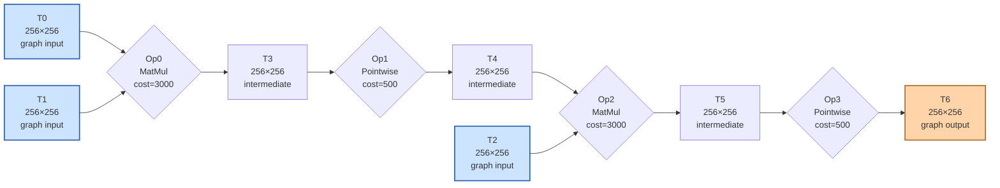

# Benchmark mlsys-2026-3.json

- **Tensors:** 7
- **Ops:** 4 (MatMul: 2, Pointwise: 2)
- **Fast memory capacity:** 30000
- **Slow memory bandwidth:** 10.0
- **Native granularity:** [128, 128]

## Graph I/O

- **Graph inputs** (3): T0 (256×256=65536), T1 (256×256=65536), T2 (256×256=65536)
- **Graph outputs** (1): T6 (256×256=65536)

## Physical bounds

- **H.1 memory lower bound** (load inputs + store outputs): **26214.40**
- **H.1 compute lower bound** (Σ base_cost — undisputable): **7000.00**
- **H.1 absolute floor** (max of memory and simple compute): **26214.40**
- **H.3 tight compute floor** (Σ native_tiles × base_cost — model-dependent): **28000.00**
- **H.2 brute-force memory upper bound** (every op in its own subgraph): **65536.00**

Any reported total latency `< H.1 absolute floor` is physically impossible — no interpretation can save it.
Any reported total latency `< H.3 tight compute floor` violates our native-tile reading of base_cost.
Any reported total latency `> H.2` is a quality warning (worse than no-fusion brute-force).

## DAG

