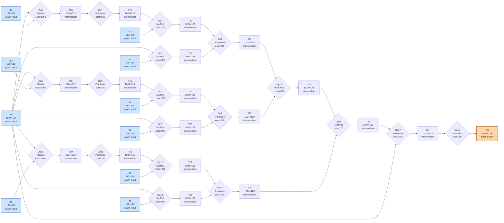

# Benchmark mlsys-2026-5.json

- **Tensors:** 29
- **Ops:** 19 (MatMul: 9, Pointwise: 10)
- **Fast memory capacity:** 30000
- **Slow memory bandwidth:** 15.0
- **Native granularity:** [128, 128]

## Graph I/O

- **Graph inputs** (10): T0 (1024×128=131072), T1 (128×512=65536), T2 (512×128=65536), T3 (128×512=65536), T4 (512×128=65536), T5 (128×512=65536), T6 (512×128=65536), T7 (128×128=16384), T8 (128×128=16384), T9 (128×128=16384)
- **Graph outputs** (1): T28 (1024×128=131072)

## Physical bounds

- **H.1 memory lower bound** (load inputs + store outputs): **46967.47**
- **H.1 compute lower bound** (Σ base_cost — undisputable): **9200.00**
- **H.1 absolute floor** (max of memory and simple compute): **46967.47**
- **H.3 tight compute floor** (Σ native_tiles × base_cost — model-dependent): **160000.00**
- **H.2 brute-force memory upper bound** (every op in its own subgraph): **728541.87**

Any reported total latency `< H.1 absolute floor` is physically impossible — no interpretation can save it.
Any reported total latency `< H.3 tight compute floor` violates our native-tile reading of base_cost.
Any reported total latency `> H.2` is a quality warning (worse than no-fusion brute-force).

## DAG

