# Benchmark mlsys-2026-7.json

- **Tensors:** 21
- **Ops:** 15 (MatMul: 5, Pointwise: 10)
- **Fast memory capacity:** 35000
- **Slow memory bandwidth:** 15.0
- **Native granularity:** [128, 128]

## Graph I/O

- **Graph inputs** (6): T0 (256×256=65536), T1 (256×256=65536), T2 (256×256=65536), T3 (256×256=65536), T15 (256×256=65536), T18 (256×256=65536)
- **Graph outputs** (1): T20 (256×256=65536)

## Physical bounds

- **H.1 memory lower bound** (load inputs + store outputs): **30583.47**
- **H.1 compute lower bound** (Σ base_cost — undisputable): **12800.00**
- **H.1 absolute floor** (max of memory and simple compute): **30583.47**
- **H.3 tight compute floor** (Σ native_tiles × base_cost — model-dependent): **51200.00**
- **H.2 brute-force memory upper bound** (every op in its own subgraph): **157286.40**

Any reported total latency `< H.1 absolute floor` is physically impossible — no interpretation can save it.
Any reported total latency `< H.3 tight compute floor` violates our native-tile reading of base_cost.
Any reported total latency `> H.2` is a quality warning (worse than no-fusion brute-force).

## DAG

```mermaid
flowchart LR
    T0["T0<br/>256×256<br/>graph input"]:::gi
    T1["T1<br/>256×256<br/>graph input"]:::gi
    T2["T2<br/>256×256<br/>graph input"]:::gi
    T3["T3<br/>256×256<br/>graph input"]:::gi
    T4["T4<br/>256×256<br/>intermediate"]
    T5["T5<br/>256×256<br/>intermediate"]
    T6["T6<br/>256×256<br/>intermediate"]
    T7["T7<br/>256×256<br/>intermediate"]
    T8["T8<br/>256×256<br/>intermediate"]
    T9["T9<br/>256×256<br/>intermediate"]
    T10["T10<br/>256×256<br/>intermediate"]
    T11["T11<br/>256×256<br/>intermediate"]
    T12["T12<br/>256×256<br/>intermediate"]
    T13["T13<br/>256×256<br/>intermediate"]
    T14["T14<br/>256×256<br/>intermediate"]
    T15["T15<br/>256×256<br/>graph input"]:::gi
    T16["T16<br/>256×256<br/>intermediate"]
    T17["T17<br/>256×256<br/>intermediate"]
    T18["T18<br/>256×256<br/>graph input"]:::gi
    T19["T19<br/>256×256<br/>intermediate"]
    T20["T20<br/>256×256<br/>graph output"]:::go
    Op0{"Op0<br/>MatMul<br/>cost=1500"}
    T0 --> Op0
    T1 --> Op0
    Op0 --> T4
    Op1{"Op1<br/>Pointwise<br/>cost=200"}
    T4 --> Op1
    Op1 --> T5
    Op2{"Op2<br/>MatMul<br/>cost=1500"}
    T5 --> Op2
    T2 --> Op2
    Op2 --> T6
    Op3{"Op3<br/>Pointwise<br/>cost=200"}
    T6 --> Op3
    Op3 --> T7
    Op4{"Op4<br/>MatMul<br/>cost=1500"}
    T7 --> Op4
    T3 --> Op4
    Op4 --> T8
    Op5{"Op5<br/>Pointwise<br/>cost=800"}
    T0 --> Op5
    Op5 --> T9
    Op6{"Op6<br/>Pointwise<br/>cost=800"}
    T9 --> Op6
    Op6 --> T10
    Op7{"Op7<br/>Pointwise<br/>cost=800"}
    T10 --> Op7
    Op7 --> T11
    Op8{"Op8<br/>Pointwise<br/>cost=800"}
    T11 --> Op8
    Op8 --> T12
    Op9{"Op9<br/>Pointwise<br/>cost=800"}
    T12 --> Op9
    Op9 --> T13
    Op10{"Op10<br/>Pointwise<br/>cost=500"}
    T8 --> Op10
    T13 --> Op10
    Op10 --> T14
    Op11{"Op11<br/>MatMul<br/>cost=1500"}
    T14 --> Op11
    T15 --> Op11
    Op11 --> T16
    Op12{"Op12<br/>Pointwise<br/>cost=200"}
    T16 --> Op12
    Op12 --> T17
    Op13{"Op13<br/>MatMul<br/>cost=1500"}
    T17 --> Op13
    T18 --> Op13
    Op13 --> T19
    Op14{"Op14<br/>Pointwise<br/>cost=200"}
    T19 --> Op14
    Op14 --> T20

    classDef gi fill:#cde4ff,stroke:#2a5fb0,stroke-width:2px
    classDef go fill:#ffd4a8,stroke:#b06a2a,stroke-width:2px
    classDef dangling fill:#eeeeee,stroke:#999,stroke-dasharray: 3 3
```

