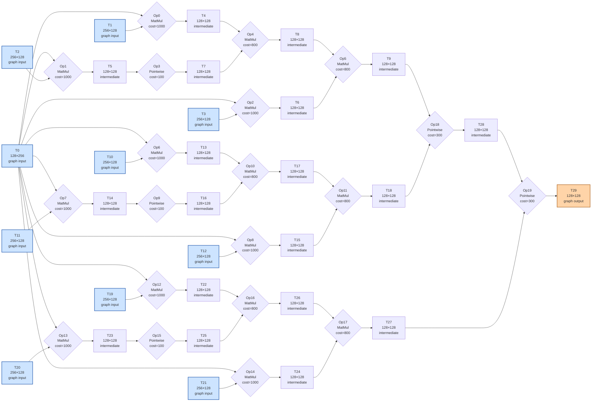

# Benchmark mlsys-2026-8.json

- **Tensors:** 30
- **Ops:** 20 (MatMul: 15, Pointwise: 5)
- **Fast memory capacity:** 25000
- **Slow memory bandwidth:** 12.0
- **Native granularity:** [128, 128]

## Graph I/O

- **Graph inputs** (10): T0 (128×256=32768), T1 (256×128=32768), T2 (256×128=32768), T3 (256×128=32768), T10 (256×128=32768), T11 (256×128=32768), T12 (256×128=32768), T19 (256×128=32768), T20 (256×128=32768), T21 (256×128=32768)
- **Graph outputs** (1): T29 (128×128=16384)

## Physical bounds

- **H.1 memory lower bound** (load inputs + store outputs): **28672.00**
- **H.1 compute lower bound** (Σ base_cost — undisputable): **14700.00**
- **H.1 absolute floor** (max of memory and simple compute): **28672.00**
- **H.3 tight compute floor** (Σ native_tiles × base_cost — model-dependent): **14700.00**
- **H.2 brute-force memory upper bound** (every op in its own subgraph): **102400.00**

Any reported total latency `< H.1 absolute floor` is physically impossible — no interpretation can save it.
Any reported total latency `< H.3 tight compute floor` violates our native-tile reading of base_cost.
Any reported total latency `> H.2` is a quality warning (worse than no-fusion brute-force).

## DAG

